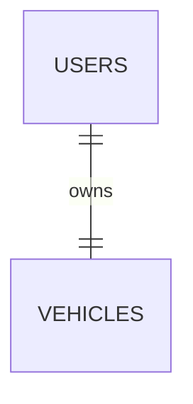

### Detailed Specification Body:

```markdown
# Feature: Driver Verification Resubmission & One-Vehicle Enforcement

## 1. User Story
As an unverified or rejected driver applicant, I want to view my current submitted profile and vehicle details, edit any fields, and resubmit the entire package for admin review. I should be able to do this repeatedly until I am approved. Once approved, I should no longer be able to edit these details (to maintain audit integrity). Additionally, the system must strictly enforce that a driver account is linked to exactly *one* vehicle.

## 2. State Machine (Driver Verification)

| State | Description | User Can Edit/Resubmit? |
|-------|-------------|--------------------------|
| `unverified` | Signed up but has never submitted verification docs. | Yes |
| `pending` | Submitted docs; waiting for admin review. | No (must wait for rejection or approval). |
| `rejected` | Admin reviewed and rejected the application (with reason). | Yes (can edit and resubmit). |
| `approved` | Verified successfully. | **No (locked forever)** |

> **Edge Case:** If a verified driver needs to change their vehicle (e.g., bought a new car), they must contact support to handle it manually (offline process or via a support ticket). This is out of scope for this MVP.

## 3. Data Model Changes

### 3.1 Alter `users` Table – Add Verification Status

Add a column to track the driver's verification state:

```sql
ALTER TABLE users ADD COLUMN verification_status VARCHAR(20) 
  DEFAULT 'unverified' 
  CHECK (verification_status IN ('unverified', 'pending', 'rejected', 'approved'));
```

**Backward Compatibility:** For existing drivers (from earlier PRD versions), run a migration:  
If `is_verified` existed, map it to `approved`, else `unverified`. Since we are using this new spec, we will create the column fresh.

### 3.2 Enforce One Vehicle Per Driver (Physical Constraint)

Currently, the ER diagram shows `USERS ||--o{ VEHICLES : owns` (one-to-many). To enforce exactly one vehicle per driver at any time, we need:

**Option A (Recommended):** Add a `UNIQUE` constraint on `user_id` in the `vehicles` table.

```sql
ALTER TABLE vehicles ADD CONSTRAINT unique_driver_vehicle UNIQUE (user_id);
```

**Option B (Soft enforcement):** Check via application logic before INSERT/UPDATE.  
*We recommend Option A as it ensures database-level integrity.*

> **Migration Note:** Ensure all existing drivers in your staging/prod have exactly one vehicle before adding this constraint. If not, clean up duplicates or archive old vehicles.

### 3.3 Store Rejection Reason (Optional but recommended)

To help drivers understand why they were rejected:

```sql
ALTER TABLE users ADD COLUMN verification_rejection_reason TEXT NULL;
ALTER TABLE users ADD COLUMN verification_rejected_at TIMESTAMPTZ NULL;
ALTER TABLE vehicles ADD COLUMN verification_rejection_reason TEXT NULL;
ALTER TABLE vehicles ADD COLUMN verification_rejected_at TIMESTAMPTZ NULL;
```

*Alternatively, store all review logs in a `moderation_history` table. For MVP, just storing the latest rejection reason on `users` is enough.*

## 4. API Endpoints

### 4.1 `GET /driver/verification-status`

**Purpose:** Returns the current state, so the UI knows whether to show a read-only profile, a disabled form, or an editable form.

**Authentication:** JWT (must be a driver).

**Response:**
```json
{
  "status": "rejected",
  "can_edit": true,
  "rejection_reason": "Vehicle insurance document is expired. Please upload a valid one.",
  "submitted_at": "2026-08-01T10:00:00Z"
}
```
| Status | `can_edit` | UI Behavior |
|--------|------------|-------------|
| `unverified` | true | Show empty form for submission. |
| `pending` | false | Show read-only preview with "Under Review" banner. |
| `rejected` | true | Show editable form pre-filled with previous data, with rejection reason highlighted. |
| `approved` | false | Show read-only "Verified" profile. Edit button hidden/disabled. |

---

### 4.2 `GET /driver/verification` – Fetch Current Submission Data

**Purpose:** Fetch the existing profile and vehicle data to pre-fill the edit form.

**Response:**
```json
{
  "driver_profile": {
    "full_name": "Khaled Al-Hassan",
    "phone": "+962790000000",
    "id_photo_url": "https://...",
    "license_photo_url": "https://..."
  },
  "vehicle": {
    "vehicle_id": "v_123",
    "make_model": "Toyota Corolla",
    "year": 2021,
    "plate_number": "ABC-1234",
    "registration_photo_url": "https://...",
    "insurance_photo_url": "https://...",
    "color": "White"
  },
  "status": "rejected",
  "rejection_reason": "License photo is blurry."
}
```

---

### 4.3 `PUT /driver/verification` – Submit / Resubmit Verification

**Purpose:** Submit the complete driver + vehicle data for review. Replaces the old submission entirely (if exists). Triggers a re-review.

**Validation Rules:**
1. Driver must be `unverified`, `rejected` (or `pending`? - We will block if `pending` to prevent spamming).
   - If status is `approved` → return `403 Forbidden: Verified drivers cannot update their details via this endpoint. Contact support.`
   - If status is `pending` → return `409 Conflict: Your application is already under review. Please wait.`
   - If status is `unverified` or `rejected` → proceed.
2. A vehicle object **must** be provided. If a vehicle already exists for this driver, update it. If not, create it.
3. Ensure total vehicles linked to this driver is exactly 1 after this operation (due to DB unique constraint).

**Request Body:**
```json
{
  "driver_profile": {
    "full_name": "Khaled Al-Hassan",
    "id_photo_url": "https://...",
    "license_photo_url": "https://..."
  },
  "vehicle": {
    "make_model": "Toyota Corolla",
    "year": 2021,
    "plate_number": "ABC-1234",
    "registration_photo_url": "https://...",
    "insurance_photo_url": "https://...",
    "color": "White"
  }
}
```

**Response (200 OK or 201 Created):**
```json
{
  "message": "Verification submitted successfully. It will be reviewed within 24 hours.",
  "status": "pending",
  "submitted_at": "2026-08-10T14:30:00Z"
}
```

**Implementation Notes:**
- If the driver already has a vehicle, update its fields.
- If the driver doesn't have a vehicle, insert a new one.
- Set the driver's `verification_status` to `pending`.
- Clear any previous `rejection_reason`.
- Push a notification to admins (`notification:new` via WebSocket) to alert them about the new submission.

---

## 5. Admin Review Integration (Existing)

This spec integrates with the existing Admin Dashboard (from PRD Section 15.3):

- Admin sees the verification queue (`Verification Queue` widget).
- Admin can **Approve** or **Reject**.
- If **Rejected**, the admin **must** provide a `rejection_reason` (required).
- The reason is stored in the `users` table.
- The driver's status is updated to `rejected`.

## 6. Flow Diagrams

### 6.1 Driver Resubmission Flow
```mermaid
flowchart TD
    S[Start] --> A[Driver opens Verification Screen]
    A --> B[Call GET /verification-status]
    B --> C{Status?}
    
    C -->|approved| D[Show Read-Only Verified Profile + "Locked" icon]
    D --> E([End])
    
    C -->|pending| F[Show Preview with "Under Review" banner. Disable inputs.]
    F --> E
    
    C -->|rejected| G[Show editable form. Highlight rejection reason.]
    G --> H[Driver edits fields]
    H --> I[Click Submit]
    I --> J[Call PUT /verification]
    J --> K[Status changes to pending. Notify admin.]
    K --> E
    
    C -->|unverified| L[Show empty form]
    L --> I
```

### 6.2 One-Vehicle Enforcement (DB-Level)

*The double-bar `||--||` signifies a strict one-to-one relationship enforced by the `UNIQUE(user_id)` constraint.*

## 7. Validation & Error Handling

| Scenario | Response |
|----------|----------|
| Verified driver (`approved`) tries to `PUT /verification` | `403 Forbidden: Verified drivers cannot change details. Contact support.` |
| Driver with `pending` status tries to resubmit | `409 Conflict: Under review. Please wait for the admin's decision.` |
| Driver tries to create a second vehicle (bypassing the unique constraint) | The DB will throw a `duplicate key` error. Catch this in the API and return `422 Unprocessable Entity: You already have a registered vehicle. Update it instead.` |
| Missing required fields (e.g., license_photo) | `422 Validation: license_photo is required.` |

## 8. UI/UX Considerations (Wireframe Notes)

- **Verification Status Banner:** Show a top banner on the Driver Home screen with status. e.g., "Your application is pending review" / "Rejected: Please update your license" / "You are verified!".
- **Form Field Locking:** Disable `Phone` editing (since it's used for OTP) but allow Name, ID/License uploads, and vehicle details.
- **Rejection Highlighting:** If `rejection_reason` contains "license", highlight the license upload field with a red border and a small hint text.

## 9. Migration Script (for Existing Data)

If there are existing `drivers` from early alpha, run:

```sql
-- Step 1: Add status column
ALTER TABLE users ADD COLUMN verification_status VARCHAR(20) DEFAULT 'unverified';

-- Step 2: Migrate existing data (assume if they have a verified flag or their vehicle is approved)
-- Assuming we have an 'is_verified' column or we check if vehicle verification is complete.
-- For safety, set all existing users with verified vehicles to 'approved'.
-- If not, set to 'unverified' or 'pending' if we have a partial submission.
-- This is a placeholder; you'll need to tailor this to your current data state.
UPDATE users SET verification_status = 'approved' WHERE is_verified = true;
UPDATE users SET verification_status = 'unverified' WHERE is_verified = false;

-- Step 3: Enforce one vehicle per user (check for duplicates first!)
-- If duplicate vehicles exist, archive the oldest (set deleted_at) or merge manually.
ALTER TABLE vehicles ADD CONSTRAINT unique_driver_vehicle UNIQUE (user_id);
```

## 10. Acceptance Criteria

- [ ] **Fresh Driver:** Unverified driver sees an empty submission form. Submits data → status becomes `pending`.
- [ ] **Rejected Driver:** Driver sees their old data pre-filled, sees the rejection reason, edits data, and resubmits → status becomes `pending` again.
- [ ] **Approved Driver:** Driver sees a "Verified" badge. The submit/edit button is completely hidden/disabled. Trying to call `PUT /verification` returns `403`.
- [ ] **One Vehicle:** If a driver somehow has two vehicles in the DB, the unique constraint prevents inserting a third. Update operation modifies the existing single vehicle.
- [ ] **Admin Notifications:** When a driver resubmits, the admin dashboard "Verification Queue" refreshes (via WebSocket `admin:verification_new` event) to show the new entry at the top.
- [ ] **Audit Trail:** Every status change (`pending` → `approved`, `pending` → `rejected`) is logged (by adding `updated_at` and `status_changed_at` timestamps).

## 11. Future Enhancements (Out of Scope)

- **Support-Initiated Edits:** Allow support to unlock an approved driver's profile for limited changes (e.g., new car plate) via an admin override.
- **Multiple Cars per Driver:** If the business decides to allow fleet owners to register multiple vehicles later, we would remove the `UNIQUE` constraint and add a "primary/default" vehicle flag. But for now, we strictly enforce "one car" as requested.
```
